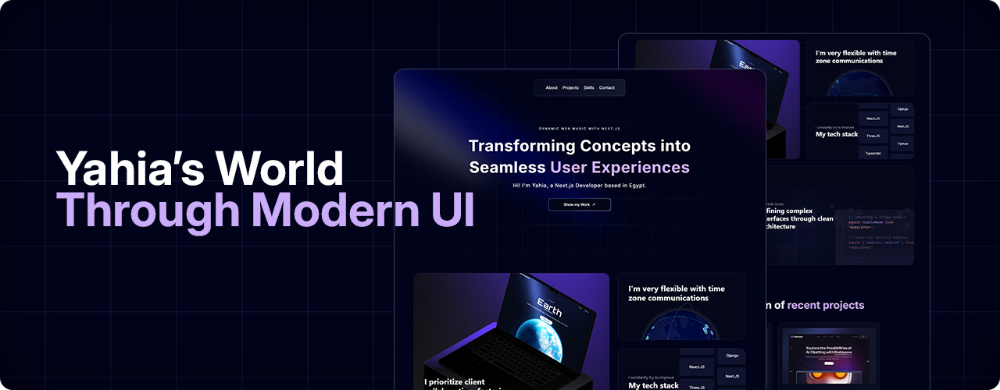

   
    
   
  

    
    
    
    
    
  

  <h3 align="center">Portfolio25</h3>

  

    A polished, interactive portfolio website built to showcase my professional journey in 2025.  
    Developed using modern frameworks and crafted with a focus on precision, animation, and responsive design.
  

---

## Overview

**Portfolio25** was created on April 8, 2025, as a showcase of my development skills and creative vision. It blends motion, interactivity, and clarity through a thoughtful user experience.

---

## Features

- **Hero Section**: A spotlight introduction with animated background, built to leave a strong first impression  
- **Bento Grid**: Structured layout using advanced CSS to present personal highlights  
- **3D Elements**: Interactive GitHub-style globe and dynamic hover effects for a tactile experience  
- **Testimonials**: Animated section to display social proof and professional endorsements  
- **Work Experience**: Timeline and content tailored to establish credibility  
- **Canvas Visuals**: A creative, animated canvas effect in the "Approaches" section  
- **Skills Display**: Responsive skill grid with a smooth lamp-hover animation  
- **Fully Responsive**: Optimized for all devices and screen sizes

---

## Tech Stack

- [Next.js](https://nextjs.org)
- [React.js](https://reactjs.org)
- [TypeScript](https://www.typescriptlang.org/)
- [Three.js](https://threejs.org)
- [Framer Motion](https://www.framer.com/motion/)

Live Preview [View Portfolio25](https://portfolio25-one.vercel.app)

---

## Get in Touch

I’m available for freelance work and open to collaborations.

Contact: **[yahialord4315@gmail.com](mailto:yahialord4315@gmail.com)**  
Portfolio: **[https://portfolio25-one.vercel.app](https://portfolio25-one.vercel.app)**

---

## License

MIT License © 2025 Yahia Badr
